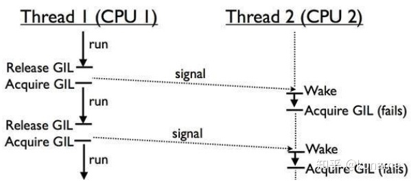

# 安装

### windows

```python
https://blog.csdn.net/weixin_40844416/article/details/80889165
```

python2 和 python3 共存的方法：

[Windows10系统下安装python2和python3双版本 - 暮光微凉 - 博客园 (cnblogs.com)](https://www.cnblogs.com/schut/p/10344597.html)

## 1. Python线程模块

GIL（Global Interpreter Lock，全局解释器锁）不是Python独有的特性，它只是在实现CPython（Python解释器）时，引入的一个概念。在官方网站中定义如下：

> In CPython, the global interpreter lock, or GIL, is a mutex that prevents multiple native threads from executing Python bytecodes at once. This lock is necessary mainly because CPython’s memory management is not thread-safe. (However, since the GIL exists, other features have grown to depend on the guarantees that it enforces.)

由定义可知，GIL是一个互斥锁（mutex）。它阻止了 多个线程同时执行Python字节码，毫无疑问，这降低了执行效率。理解GIL的必要性，需要了解CPython对于线程安全的内存管理机制。

首先，我们来看看单核CPU下，多线程任务是如何调度的。


由图可知，由于GIL的机制，单核CPU在同一时刻只有一个线程在运行。当线程遇到IO操作或Timer Tick到期，释放GIL锁。其他的两个线程去竞争这把锁，得到锁之后，才开始运行。

线程释放GIL锁有两种情况，一是遇到IO操作，二是Time Tick到期。IO操作很好理解，比如发出一个http请求，等待响应。那么Time Tick到期是什么呢？Time Tick规定了线程的最长执行时间，超过时间后自动释放GIL锁。

虽然都是释放GIL锁，但这两种情况是不一样的。比如，Thread1遇到IO操作释放GIL，由Thread2和Thread3来竞争这个GIL锁，Thread1不再参与这次竞争。如果是Thread1因为Time Tick到期释放GIL，那么三个线程可以同时竞争这把GIL锁，可能出现Thread1在竞争中胜出，再次执行的情况。单核CPU下，这种情况不算特别糟糕。因为只有1个CPU，所以CPU的利用率是很高的。

在多核CPU下，由于GIL锁的全局特性，无法发挥多核的特性，GIL锁会使得多线程任务的效率大大降低。



Thread1在CPU1上运行，Thread2在CPU2上运行。GIL是全局的，CPU2上的Thread2需要等待CPU1上的Thread1让出GIL锁，才有可能执行。如果在多次竞争中，Thread1都胜出，Thread2没有得到GIL锁，意味着CPU2一直是闲置的，无法发挥多核的优势。

为了避免同一线程霸占CPU，在python3.x中，线程会自动的调整自己的优先级，使得多线程任务执行效率更高。

既然GIL降低了多核的效率，那保留它的目的是什么呢？这就和线程执行的安全有关。

准确的说，GIL的线程安全是粗粒度的。也就是说，有GIL都不意味着线程安全。比如下面这个例子:

```python3
def add():
    global n
    for i in range(10**1000):
        n = n +1
def sub():
    global n
    for i in range(10**1000):
        n = n - 1
n = 0
import threading
a = threading.Thread(target=add,)
b = threading.Thread(target=sub,)
a.start()
b.start()
#join 用于阻塞主线程，避免过早打印n
a.join()
b.join()
print n
```

上面的程序对n做了同样数量的加法和减法，那么n理论上是0。但运行程序，打印n，发现它不是0。问题出在哪里呢，问题在于python的每行代码不是原子化的操作。比如n = n+1这步，不是一次性执行的。如果去查看python编译后的字节码执行过程，可以看到如下结果。

```text
19 LOAD_GLOBAL              1 (n)
22 LOAD_CONST               3 (1)
25 BINARY_ADD          
26 STORE_GLOBAL             1 (n)
```

从过程可以看出，n = n +1 操作分成了四步完成。因此，n = n+1不是一个原子化操作。

1.加载全局变量n，2.加载常数1，3.进行二进制加法运算，4.将运算结果存入变量n。

根据前面的线程释放GIL锁原则，线程a执行这四步的过程中，有可能会让出GIL。如果这样，n=n+1的运算过程就被打乱了。最后的结果中，得到一个非零的n也就不足为奇。

这就是为什么我们说GIL是粗粒度的，它只保证了一定程度的安全。如果要做到线程的绝对安全，是不是所有的非IO操作，我们都需要自己再加一把锁呢？答案是否定的。在python中，有些操作是是原子级的，它本身就是一个字节码，GIL无法在执行过程中释放。对于这种原子级的方法操作，我们无需担心它的安全。比如sort方法，[1,4,2].sort()，翻译成字节码就是CALL METHOD 0。只有一行，无法再分，所以它是线程安全的。

**总结**

对于IO密集型应用，多线程的应用和多进程应用区别不大。即便有GIL存在，由于IO操作会导致GIL释放，其他线程能够获得执行权限。由于多线程的通讯成本低于多进程，因此偏向使用多线程。

对于计算密集型应用，多线程处于绝对劣势，可以采用多进程或协程。

### 1.1 实际使用

python主要通过`thread`和`threading`这两个模块来实现多线程支持。python的thread模块是比较底层的模块，`threding`是对thread做了一些封装，可以更方便的被使用。但是python由于GIL的存在无法使用threading充分利用GPU资源，如果想充分发挥多核CPU的计算能力需要使用`multiprocessing`模块。

### 1.1.1 如何创建线程

`python3.x`中已经放弃了`python2.x`中采用函数式`thread`模块中的`start_new_thread()`函数来产生新线程的方式。

python3中通过threading模块创建新的线程有两种方法：

第一种是通过threading.Thread(Target=executable Method)——即传递给Thread对象一个可执行方法（或对象）。

第二种是继承threading.Thread定义子类并重写run()方法。

（1）通过threading.Thread进行创建多线程

```python

```


