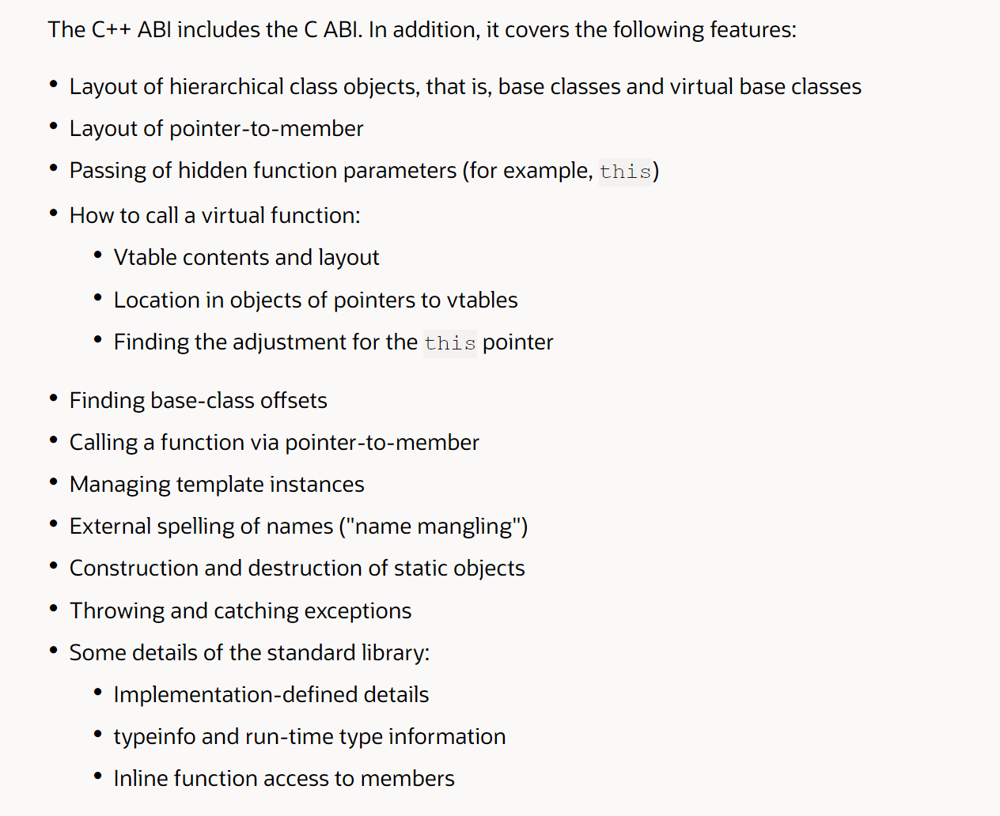

# 什么是应用程序接口（ABI）

ABI是编程语言具体实现细节的描述。

（一些有助于理解的废话：编译器需要Application Binary Interface (ABI) 来支持新的编程语言特性。所有的程序员都希望能够让新的编译器重新编译他们的代码（生成性能更好的机器码）来获得更好的性能。如果ABI并没有一套规范并且这套规范经常更改，并没有固定下来的时候，不同的编译器就会有不同的编程语言实现，导致去维护不同模块的代码特别痛苦。为了解决这个问题，原来的做法是所有的模块代码必须使用同一个编译器进行编译。为了让不同模块的代码一起工作，需要一个固定的ABI描述编程语言的信息。）

## C语言

C语言的ABI定义了下面的内容：

* 不同类型的大小和内存分布（char, int, float and so on)
* 组合类型的内存分布 (arrays and structs)
* 程序员定义名称的外部（链接器可见）拼写
* 函数调用机器码序列
* 内存栈分布
* 寄存器的使用规定

## c++ 语言

C++ ABI包括了C的ABI。另外它包括下面一些特征：

